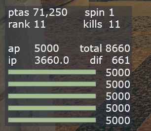

# RE4R SRT Overlay with DA0 stuff

Original by  [resyst (github.com)](https://github.com/resyst)

Displays normal SRT stuff in addition to DA0 related info, total points, and how much points you need to lose to get to a DA0 value

TO INSTALL: Install [REFramework at Resident Evil 4 (2023) - Nexus mods and community](https://www.nexusmods.com/residentevil42023/mods/12) , then put srt-overlay.lua in reframework/autorun folder

Right now no customisation options and its kinda messy

